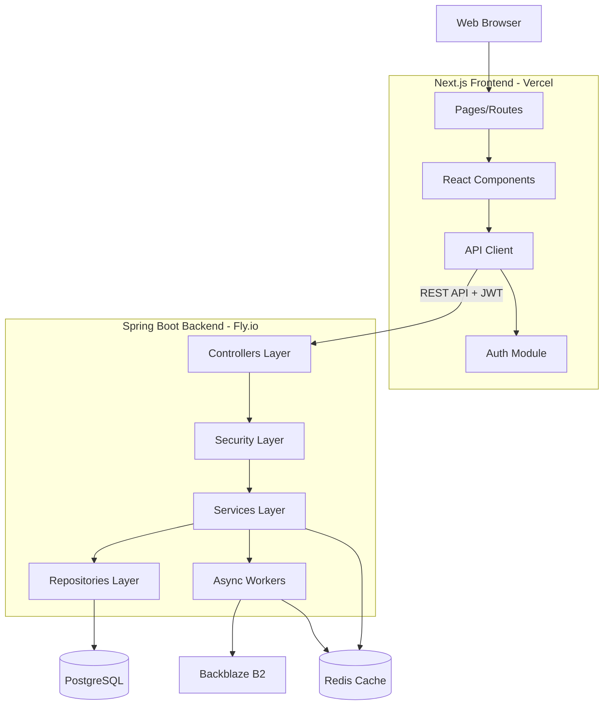

# Design Document

## Overview

MiniSocial is a full-stack scalable social network MVP consisting of a Next.js frontend and a Spring Boot 3.3 backend. The frontend provides a responsive web interface with server-side rendering and infinite scroll. The backend follows a layered architecture with controllers, services, repositories, and configuration components. The system uses PostgreSQL for persistent storage, Redis for feed caching, and Backblaze B2 for media storage. Asynchronous processing handles resource-intensive operations like image processing and feed rebuilding.

## Architecture

### High-Level Architecture



### Technology Stack

**Frontend:**

- **Framework**: Next.js 14+ (App Router)
- **Language**: TypeScript
- **HTTP Client**: Axios with interceptors
- **Styling**: Tailwind CSS or CSS Modules
- **State Management**: React hooks
- **Deployment**: Vercel

**Backend:**

- **Framework**: Spring Boot 3.3 with Maven
- **Language**: Java 17 (record classes, pattern matching)
- **Database**: PostgreSQL with Spring Data JPA
- **Cache**: Redis with Lettuce client and Spring Data Redis
- **Storage**: Backblaze B2 via AWS SDK for Java (S3 client)
- **Security**: Spring Security with JWT (jjwt library)
- **Password Hashing**: BCrypt
- **Async Processing**: Spring @Async with custom TaskExecutor
- **Validation**: Spring Validation (jakarta.validation)
- **Deployment**: Fly.io

**Infrastructure:**

- **Local Development**: Docker Compose
- **CI/CD**: GitHub Actions

## Components and Interfaces

## Frontend Components

### 1. Project Structure

```
frontend/
├── app/
│   ├── login/
│   │   └── page.tsx
│   ├── feed/
│   │   └── page.tsx
│   ├── post/
│   │   └── page.tsx
│   ├── layout.tsx
│   └── page.tsx
├── lib/
│   ├── api.ts
│   └── auth.ts
├── components/
│   ├── Header.tsx
│   ├── PostCard.tsx
│   └── AuthGuard.tsx
├── types/
│   └── index.ts
├── public/
│   └── logo.svg
├── next.config.js
├── tailwind.config.js
└── package.json
```

### 2. Pages and Routes

**app/layout.tsx**

- Root layout component
- Includes Header component
- Wraps children with AuthGuard for protected routes
- Sets up global styles and metadata

**app/page.tsx**

- Landing/home page
- Redirects authenticated users to /feed
- Shows welcome message and login link for unauthenticated users

**app/login/page.tsx**

- Login and registration form
- Tabs or toggle between login/register modes
- Calls `/auth/login` or `/auth/register` endpoints
- Stores JWT token on success
- Redirects to /feed after authentication

**app/feed/page.tsx**

- Server-side rendered feed page
- Fetches initial feed data using `async` function
- Implements infinite scroll with client-side loading
- Displays PostCard components for each feed item
- Shows empty state when no posts available

**app/post/page.tsx**

- Post creation form
- Text area for content
- File input for image upload
- Converts image to base64 or FormData
- Calls `/posts` endpoint
- Redirects to /feed on success

### 3. Components

**components/Header.tsx**

- Navigation bar with logo
- Links to /feed and /post
- Logout button (calls auth.logout())
- Displays user email from token
- Responsive design

**components/PostCard.tsx**

- Displays single post
- Shows author info, content, image, timestamp
- Formatted timestamp (e.g., "2 hours ago")
- Responsive image handling

**components/AuthGuard.tsx**

- Client component that checks authentication
- Redirects to /login if no token
- Shows loading state during check
- Wraps protected pages

### 4. API Client Module

**lib/api.ts**

```typescript
import axios from "axios";
import { getToken, clearToken } from "./auth";

const api = axios.create({
  baseURL: process.env.NEXT_PUBLIC_API_URL || "http://localhost:8080",
  headers: {
    "Content-Type": "application/json",
  },
});

// Request interceptor - attach JWT
api.interceptors.request.use((config) => {
  const token = getToken();
  if (token) {
    config.headers.Authorization = `Bearer ${token}`;
  }
  return config;
});

// Response interceptor - handle 401
api.interceptors.response.use(
  (response) => response,
  (error) => {
    if (error.response?.status === 401) {
      clearToken();
      window.location.href = "/login";
    }
    return Promise.reject(error);
  }
);

export default api;
```

**lib/auth.ts**

```typescript
export function getToken(): string | null {
  if (typeof window === "undefined") return null;
  return localStorage.getItem("jwt_token");
}

export function setToken(token: string): void {
  localStorage.setItem("jwt_token", token);
}

export function clearToken(): void {
  localStorage.removeItem("jwt_token");
}

export function logout(): void {
  clearToken();
  window.location.href = "/login";
}

export function isAuthenticated(): boolean {
  return !!getToken();
}
```

### 5. TypeScript Types

**types/index.ts**

```typescript
export interface User {
  id: number;
  email: string;
}

export interface Post {
  postId: number;
  userId: number;
  content: string;
  imageUrl?: string;
  createdAt: string;
}

export interface FeedItem {
  postId: number;
  authorId: number;
  content: string;
  imageUrl?: string;
  createdAt: string;
}

export interface LoginRequest {
  email: string;
  password: string;
}

export interface LoginResponse {
  token: string;
  userId: number;
  email: string;
}

export interface RegisterRequest {
  email: string;
  password: string;
}

export interface CreatePostRequest {
  content: string;
  imageData?: string;
}
```

### 6. Configuration

**next.config.js**

```javascript
/** @type {import('next').NextConfig} */
const nextConfig = {
  images: {
    domains: ["your-b2-domain.com"],
  },
  env: {
    NEXT_PUBLIC_API_URL: process.env.NEXT_PUBLIC_API_URL,
  },
};

module.exports = nextConfig;
```

**package.json** (key dependencies)

```json
{
  "dependencies": {
    "next": "^14.0.0",
    "react": "^18.2.0",
    "react-dom": "^18.2.0",
    "axios": "^1.6.0",
    "typescript": "^5.3.0"
  },
  "devDependencies": {
    "@types/node": "^20.0.0",
    "@types/react": "^18.2.0",
    "tailwindcss": "^3.4.0",
    "autoprefixer": "^10.4.0",
    "postcss": "^8.4.0"
  }
}
```

## Backend Components

### 1. Main Application

**MiniSocialApplication.java**

- Entry point with `@SpringBootApplication`
- Enables async processing with `@EnableAsync`
- Configures component scanning

### 2. Security Components

**SecurityConfig.java**

- Configures Spring Security filter chain
- Disables CSRF for stateless API
- Configures JWT authentication filter
- Sets up BCrypt password encoder
- Defines public endpoints (/auth/register, /auth/login)
- Protects all other endpoints with JWT validation

**JwtUtil.java** (utility class)

- Generates JWT tokens with user claims
- Validates JWT tokens
- Extracts username from token
- Uses jjwt library (io.jsonwebtoken)

**JwtAuthenticationFilter.java**

- Extends OncePerRequestFilter
- Intercepts requests to validate JWT
- Sets authentication in SecurityContext

### 3. Authentication Module

**AuthController.java**

```java
@RestController
@RequestMapping("/auth")
public class AuthController {
    POST /register - RegisterRequest -> RegisterResponse
    POST /login - LoginRequest -> LoginResponse
}
```

**DTOs (record classes)**

- `RegisterRequest(String email, String password)`
- `RegisterResponse(Long userId, String email)`
- `LoginRequest(String email, String password)`
- `LoginResponse(String token, Long userId, String email)`

**AuthService interface**

- `RegisterResponse register(RegisterRequest request)`
- `LoginResponse login(LoginRequest request)`

**AuthServiceImpl.java**

- Implements AuthService
- Uses UserRepository for database operations
- Uses PasswordEncoder for BCrypt hashing
- Uses JwtUtil for token generation
- Integrates with RateLimiter
- Constructor injection for all dependencies

**RateLimiter.java**

- Uses `ConcurrentHashMap<String, List<Instant>>`
- Tracks requests per IP address
- Removes expired entries (older than 1 minute)
- Returns boolean for allow/deny decision
- Configured for 10 requests per minute

### 4. User Module

**User.java** (Entity)

```java
@Entity
@Table(name = "users")
public class User {
    @Id @GeneratedValue(strategy = GenerationType.IDENTITY)
    private Long id;

    @Column(unique = true, nullable = false)
    private String email;

    @Column(nullable = false)
    private String passwordHash;

    private Integer followerCount = 0;
    private Integer followingCount = 0;

    @CreationTimestamp
    private Instant createdAt;
}
```

**UserRepository interface**

- Extends JpaRepository<User, Long>
- `Optional<User> findByEmail(String email)`
- `boolean existsByEmail(String email)`

### 5. Post Module

**PostController.java**

```java
@RestController
@RequestMapping("/posts")
public class PostController {
    POST / - CreatePostRequest -> CreatePostResponse
}
```

**Post.java** (Entity)

```java
@Entity
@Table(name = "posts")
public class Post {
    @Id @GeneratedValue(strategy = GenerationType.IDENTITY)
    private Long id;

    @ManyToOne(fetch = FetchType.LAZY)
    @JoinColumn(name = "user_id", nullable = false)
    private User author;

    @Column(columnDefinition = "TEXT")
    private String content;

    private String imageUrl;

    @CreationTimestamp
    private Instant createdAt;
}
```

**DTOs (record classes)**

- `CreatePostRequest(String content, String imageData)`
- `CreatePostResponse(Long postId, Long userId, String content, String imageUrl, Instant createdAt)`

**PostService interface**

- `CreatePostResponse createPost(CreatePostRequest request, Long userId)`

**PostServiceImpl.java**

- Implements PostService
- Uses PostRepository for database operations
- Uses B2StorageService for image upload
- Triggers ImageProcessor asynchronously
- Constructor injection

**PostRepository interface**

- Extends JpaRepository<Post, Long>
- `List<Post> findByAuthorIdIn(List<Long> authorIds, Pageable pageable)`

**ImageProcessor.java**

- Annotated with `@Async`
- Processes images (resize, compress, format conversion)
- Updates post with processed image URL
- Handles errors gracefully

**B2StorageService.java**

- Configures AWS S3 client for Backblaze B2
- Uploads files with unique keys
- Returns public URL
- Handles upload failures

### 6. Follow Module

**FollowController.java**

```java
@RestController
@RequestMapping("/follow")
public class FollowController {
    POST / - FollowRequest -> FollowResponse
}
```

**Follow.java** (Entity)

```java
@Entity
@Table(name = "follows", uniqueConstraints = {
    @UniqueConstraint(columnNames = {"follower_id", "following_id"})
})
public class Follow {
    @Id @GeneratedValue(strategy = GenerationType.IDENTITY)
    private Long id;

    @ManyToOne(fetch = FetchType.LAZY)
    @JoinColumn(name = "follower_id", nullable = false)
    private User follower;

    @ManyToOne(fetch = FetchType.LAZY)
    @JoinColumn(name = "following_id", nullable = false)
    private User following;

    @CreationTimestamp
    private Instant createdAt;
}
```

**DTOs (record classes)**

- `FollowRequest(Long targetUserId)`
- `FollowResponse(Long followerId, Long followingId, Instant createdAt)`

**FollowService interface**

- `FollowResponse followUser(Long followerId, Long targetUserId)`

**FollowServiceImpl.java**

- Implements FollowService
- Uses FollowRepository for database operations
- Updates follower/following counts
- Triggers FeedBuilder asynchronously
- Constructor injection

**FollowRepository interface**

- Extends JpaRepository<Follow, Long>
- `boolean existsByFollowerIdAndFollowingId(Long followerId, Long followingId)`
- `List<Long> findFollowingIdsByFollowerId(Long followerId)`

**FeedBuilder.java**

- Annotated with `@Async`
- Rebuilds user feed in Redis
- Fetches posts from followed users
- Uses ZADD to store in sorted set
- Key format: `feed:{userId}`
- Score: timestamp (epoch seconds)

### 7. Feed Module

**FeedController.java**

```java
@RestController
@RequestMapping("/feed")
public class FeedController {
    GET / - FeedResponse (with pagination)
}
```

**DTOs (record classes)**

- `FeedResponse(List<FeedItem> items, Integer page, Integer size)`
- `FeedItem(Long postId, Long authorId, String content, String imageUrl, Instant createdAt)`

**FeedService interface**

- `FeedResponse getFeed(Long userId, Integer page, Integer size)`

**FeedServiceImpl.java**

- Implements FeedService
- Uses RedisTemplate for cache operations
- Uses ZREVRANGE to retrieve posts by score
- Fetches post details from PostRepository
- Constructor injection

### 8. Configuration

**application.yml**

```yaml
spring:
  application:
    name: minisocial
  datasource:
    url: jdbc:postgresql://localhost:5432/minisocial
    username: ${DB_USERNAME}
    password: ${DB_PASSWORD}
  jpa:
    hibernate:
      ddl-auto: validate
    show-sql: false
  data:
    redis:
      host: ${REDIS_HOST:localhost}
      port: ${REDIS_PORT:6379}
      password: ${REDIS_PASSWORD:}
      lettuce:
        pool:
          max-active: 8
          max-idle: 8
          min-idle: 2

jwt:
  secret: ${JWT_SECRET}
  expiration: 86400000

b2:
  endpoint: ${B2_ENDPOINT}
  accessKeyId: ${B2_ACCESS_KEY_ID}
  secretAccessKey: ${B2_SECRET_ACCESS_KEY}
  bucketName: ${B2_BUCKET_NAME}

async:
  corePoolSize: 5
  maxPoolSize: 10
  queueCapacity: 100
```

**AsyncConfig.java**

- Annotated with `@Configuration` and `@EnableAsync`
- Defines custom `TaskExecutor` bean
- Configures thread pool parameters
- Sets thread name prefix

**RedisConfig.java**

- Annotated with `@Configuration`
- Configures `RedisTemplate<String, Object>`
- Sets up Lettuce connection factory
- Configures serializers (String for keys, JSON for values)

## Data Models

### Database Schema

```sql
CREATE TABLE users (
    id BIGSERIAL PRIMARY KEY,
    email VARCHAR(255) UNIQUE NOT NULL,
    password_hash VARCHAR(255) NOT NULL,
    follower_count INTEGER DEFAULT 0,
    following_count INTEGER DEFAULT 0,
    created_at TIMESTAMP NOT NULL DEFAULT NOW()
);

CREATE TABLE posts (
    id BIGSERIAL PRIMARY KEY,
    user_id BIGINT NOT NULL REFERENCES users(id),
    content TEXT,
    image_url VARCHAR(500),
    created_at TIMESTAMP NOT NULL DEFAULT NOW()
);

CREATE INDEX idx_posts_user_id ON posts(user_id);
CREATE INDEX idx_posts_created_at ON posts(created_at DESC);

CREATE TABLE follows (
    id BIGSERIAL PRIMARY KEY,
    follower_id BIGINT NOT NULL REFERENCES users(id),
    following_id BIGINT NOT NULL REFERENCES users(id),
    created_at TIMESTAMP NOT NULL DEFAULT NOW(),
    UNIQUE(follower_id, following_id)
);

CREATE INDEX idx_follows_follower ON follows(follower_id);
CREATE INDEX idx_follows_following ON follows(following_id);
```

### Redis Data Structures

**Feed Cache**

- Type: Sorted Set
- Key: `feed:{userId}`
- Score: Unix timestamp (seconds)
- Value: Post ID
- TTL: 24 hours (configurable)

**Rate Limiting** (in-memory)

- Type: ConcurrentHashMap
- Key: IP address
- Value: List of Instant timestamps

## Error Handling

### Exception Hierarchy

```java
@ResponseStatus(HttpStatus.BAD_REQUEST)
public class InvalidRequestException extends RuntimeException {}

@ResponseStatus(HttpStatus.UNAUTHORIZED)
public class UnauthorizedException extends RuntimeException {}

@ResponseStatus(HttpStatus.NOT_FOUND)
public class ResourceNotFoundException extends RuntimeException {}

@ResponseStatus(HttpStatus.CONFLICT)
public class ResourceConflictException extends RuntimeException {}

@ResponseStatus(HttpStatus.TOO_MANY_REQUESTS)
public class RateLimitExceededException extends RuntimeException {}

@ResponseStatus(HttpStatus.SERVICE_UNAVAILABLE)
public class ServiceUnavailableException extends RuntimeException {}
```

### Global Exception Handler

**GlobalExceptionHandler.java**

- Annotated with `@RestControllerAdvice`
- Handles all custom exceptions
- Returns consistent error response format
- Logs errors appropriately

**Error Response Format**

```java
record ErrorResponse(
    String error,
    String message,
    Instant timestamp
) {}
```

## Testing Strategy

### Unit Tests

- Test service layer business logic
- Mock repository dependencies
- Test validation logic
- Test JWT generation and validation
- Test rate limiter logic

### Integration Tests

- Test controller endpoints with MockMvc
- Test database operations with @DataJpaTest
- Test Redis operations with embedded Redis
- Test security configuration

### Key Test Scenarios

1. User registration with duplicate email
2. Login with invalid credentials
3. JWT token validation
4. Rate limiting enforcement
5. Post creation and async image processing
6. Follow relationship creation
7. Feed retrieval from Redis
8. Error handling for all endpoints

## Deployment

### Backend Dockerfile

```dockerfile
FROM eclipse-temurin:17-jre

WORKDIR /app

COPY target/minisocial-0.0.1-SNAPSHOT.jar app.jar

EXPOSE 8080

ENTRYPOINT ["java", "-jar", "app.jar"]
```

### Docker Compose (Local Development)

**docker-compose.yml**

```yaml
version: "3.8"

services:
  frontend:
    build:
      context: ./frontend
      dockerfile: Dockerfile.dev
    ports:
      - "3000:3000"
    environment:
      - NEXT_PUBLIC_API_URL=http://localhost:8080
    volumes:
      - ./frontend:/app
      - /app/node_modules
    depends_on:
      - backend

  backend:
    build:
      context: ./backend
      dockerfile: Dockerfile
    ports:
      - "8080:8080"
    environment:
      - DB_USERNAME=postgres
      - DB_PASSWORD=postgres
      - REDIS_HOST=redis
      - REDIS_PORT=6379
      - JWT_SECRET=your-secret-key-change-in-production
      - B2_ENDPOINT=${B2_ENDPOINT}
      - B2_ACCESS_KEY_ID=${B2_ACCESS_KEY_ID}
      - B2_SECRET_ACCESS_KEY=${B2_SECRET_ACCESS_KEY}
      - B2_BUCKET_NAME=${B2_BUCKET_NAME}
    depends_on:
      - postgres
      - redis

  postgres:
    image: postgres:15-alpine
    ports:
      - "5432:5432"
    environment:
      - POSTGRES_DB=minisocial
      - POSTGRES_USER=postgres
      - POSTGRES_PASSWORD=postgres
    volumes:
      - postgres_data:/var/lib/postgresql/data

  redis:
    image: redis:7-alpine
    ports:
      - "6379:6379"
    volumes:
      - redis_data:/data

volumes:
  postgres_data:
  redis_data:
```

### GitHub Actions Workflows

**.github/workflows/frontend.yml**

```yaml
name: Deploy Frontend to Vercel

on:
  push:
    branches: [main]
    paths:
      - "frontend/**"
  pull_request:
    branches: [main]
    paths:
      - "frontend/**"

jobs:
  deploy:
    runs-on: ubuntu-latest
    steps:
      - uses: actions/checkout@v3

      - name: Setup Node.js
        uses: actions/setup-node@v3
        with:
          node-version: "18"

      - name: Install Vercel CLI
        run: npm install -g vercel

      - name: Deploy to Vercel
        working-directory: ./frontend
        run: |
          if [ "${{ github.event_name }}" == "pull_request" ]; then
            vercel --token=${{ secrets.VERCEL_TOKEN }}
          else
            vercel --prod --token=${{ secrets.VERCEL_TOKEN }}
          fi
        env:
          VERCEL_ORG_ID: ${{ secrets.VERCEL_ORG_ID }}
          VERCEL_PROJECT_ID: ${{ secrets.VERCEL_PROJECT_ID }}
```

**.github/workflows/backend.yml**

```yaml
name: Deploy Backend to Fly.io

on:
  push:
    branches: [main]
    paths:
      - "backend/**"

jobs:
  deploy:
    runs-on: ubuntu-latest
    steps:
      - uses: actions/checkout@v3

      - name: Setup Java
        uses: actions/setup-java@v3
        with:
          java-version: "17"
          distribution: "temurin"

      - name: Build with Maven
        working-directory: ./backend
        run: mvn clean package -DskipTests

      - name: Setup Fly.io
        uses: superfly/flyctl-actions/setup-flyctl@master

      - name: Deploy to Fly.io
        working-directory: ./backend
        run: flyctl deploy --remote-only
        env:
          FLY_API_TOKEN: ${{ secrets.FLY_API_TOKEN }}
```

### Environment Variables

**Backend (Fly.io):**

- `DB_USERNAME`: PostgreSQL username
- `DB_PASSWORD`: PostgreSQL password
- `REDIS_HOST`: Redis host
- `REDIS_PORT`: Redis port
- `REDIS_PASSWORD`: Redis password
- `JWT_SECRET`: Secret key for JWT signing
- `B2_ENDPOINT`: Backblaze B2 endpoint URL
- `B2_ACCESS_KEY_ID`: B2 access key
- `B2_SECRET_ACCESS_KEY`: B2 secret key
- `B2_BUCKET_NAME`: B2 bucket name

**Frontend (Vercel):**

- `NEXT_PUBLIC_API_URL`: Backend API URL (e.g., https://minisocial.fly.dev)

### Build and Run

**Local Development:**

```bash
# Start all services
docker-compose up -d

# View logs
docker-compose logs -f

# Stop all services
docker-compose down
```

**Backend Only:**

```bash
cd backend
mvn clean package -DskipTests
docker build -t minisocial-backend:latest .
docker run -p 8080:8080 minisocial-backend:latest
```

**Frontend Only:**

```bash
cd frontend
npm install
npm run dev
```

### Production Deployment

**Backend to Fly.io:**

```bash
cd backend
flyctl launch
flyctl secrets set JWT_SECRET=your-secret DB_USERNAME=user DB_PASSWORD=pass
flyctl deploy
```

**Frontend to Vercel:**

```bash
cd frontend
vercel
# Follow prompts for production deployment
```
